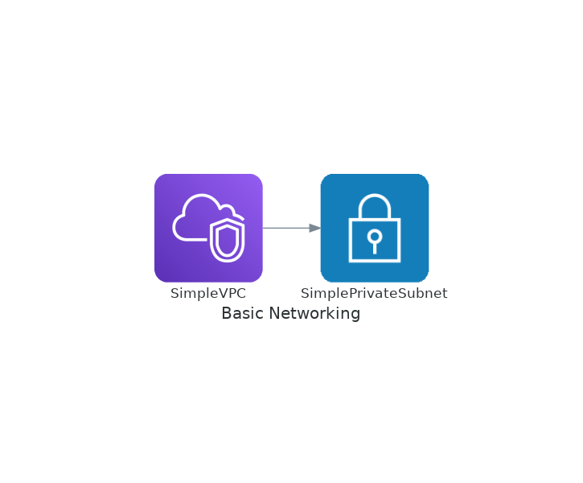

# Cloudformation template for a very simple VPC with one private subnet

This is a very simple example for Cloudformation beginners.

It creates a VPC containing a single private subnet.

Use this as a starting point to validate your IDE setup and AWS access.

